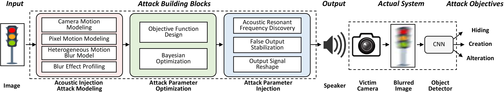

# What is PoltergeistAttack? 

Autonomous vehicles increasingly exploit computer-visionbased object detection systems to perceive environments and make critical driving decisions. To increase the quality of images, image stabilizers with inertial sensors are added to alleviate image blurring caused by camera jitter. However, such a trend opens a new attack surface. This paper identifies a system-level vulnerability resulting from the combination of the emerging image stabilizer hardware susceptible to acoustic manipulation and the object detection algorithms subject to adversarial examples. By emitting deliberately designed acoustic signals, an adversary can control the output of an inertial sensor, which triggers unnecessary motion compensation and results in a blurred image, even if the camera is stable. The blurred images can then induce object misclassification affecting safety critical decision making. We model the feasibility of such acoustic manipulation and design an attack framework that can accomplish three types of attacks, i.e., hiding, creating, and altering objects. Evaluation results demonstrate the effectiveness of our attacks against four academic object detectors (**YOLO V3/V4/V5** and **Faster R-CNN**), and one commercial detector (**Apollo**). We further introduce the concept of AMpLe  attacks, a new class of system-level security vulnerabilities resulting from a combination of adversarial machine learning and physics-based injection of information-carrying signals into hardware.

## How does PoltergeistAttack work?

    
     
    

# Simulation Evaluation

## Blur model

Adversarial blurry images are generated by our blur model with public autonomous driving image datasets as input. Our blur model can be used as a function in `blur.py`.

## Datasets

We use two autonomous driving datasets [BDD100K](https://bdd-data.berkeley.edu/) and [KITTI](http://www.cvlibs.net/datasets/kitti/) in the simulation evaluation. For both datasets, we randomly select 200 images for evaluation.

### You can download the randomly-sampled images used in our experiments.

Link here -> [google drive](https://drive.google.com/drive/folders/1bh-ys_fi02sNI-1prT3oe9tAZJrvn6W5)

## Object Detectors

We evaluate PG attacks using four academic object detectors YOLO V3/V4/V5 and Faster R-CNN, and one commercial object detector YOLO 3D used in Apollo.
The backbone networks used for the pre-trained models YOLO V3/V4/V5 and Faster R-CNN are Darknet-53 and ResNet-101, respectively. The four academic detectors are all trained on the Common Objects in Context (COCO) dataset and Apollo is trained on an unrevealed backbone network and dataset.

### The following repos are used in our experiments.

1. YOLO V3: [PyTorch-YOLOv3](https://github.com/eriklindernoren/PyTorch-YOLOv3)
2. YOLO V4: [pytorch-YOLOv4](https://github.com/Tianxiaomo/pytorch-YOLOv4)
3. YOLO V5: [yolov5](https://github.com/ultralytics/yolov5)
4. Faster R-CNN: [tf-faster-rcnn](https://github.com/endernewton/tf-faster-rcnn)
5. [Apollo 5.5.0](https://github.com/ApolloAuto/apollo)

## Bayesian Optimization

To optimize the designed objective functions, we employ [Bayesian Optimization](https://github.com/fmfn/BayesianOptimization), a sequential design strategy for global optimization of blackbox functions that does not assume any functional forms.

## Simulation Demos

- **Hiding attacks** (HA) cause an object to become undetected.

The originally detected car can be incorrectly detected under linear motion blur. (a) The car is detected with a high confidence score (0.997) without blur. (b) The car is detected with a decreased confidence score (0.919) with light linear motion blur. (c-d) The car is undetected when linear motion blur is increased.

   

- **Creating attacks** (CA) induce a non-existent object.

The originally undetected region in an image (a). Under different linear motion blur, the region can be incorrectly detected as a person class (b), a boat class (c), and a car class (d).

   

- **Altering attacks** (AA) cause an object to be misclassified.

The car (a) can be misclassified as a bus (b), a bottle (c), and a person (d) under different motion blur.

   

Here is a **demo video** showing the real-world attack effects of the three attacks introduced above.

# Real-world Attack Evaluation

In the real-world evaluation, we target a smartphone on a moving vehicle and conduct PG attacks towards it inside the vehicle via acoustic signals. Here are some [demo videos](https://sites.google.com/view/poltergeistattack/).

> @INPROCEEDINGS {
    author = {X. Ji and Y. Cheng and Y. Zhang and K. Wang and C. Yan and W. Xu and K. Fu},
    booktitle = {2021 2021 IEEE Symposium on Security and Privacy (SP)},
    title = {Poltergeist: Acoustic Adversarial Machine Learning against Cameras and Computer Vision},
    year = {2021},
    issn = {2375-1207},
    pages = {1573-1588},
    doi = {10.1109/SP40001.2021.00091},
    url = {https://doi.ieeecomputersociety.org/10.1109/SP40001.2021.00091},
    publisher = {IEEE Computer Society},
    address = {Los Alamitos, CA, USA},
    month = {may}
}

# Contact
* Prof. Wenyuan Xu (<wyxu@zju.edu.cn>)
* Prof. Xiaoyu Ji (<xji@zju.edu.cn>)

# Powered by

<table bgcolor="white">
<tr valign="middle">
<td width="50%" align="center" colspan="2">
 <a href="http://usslab.org">Ubiquitous System Security Laboratory (USSLab) 
</td>
<td width="50%" align="center" colspan="2">
  <a href="http://www.zju.edu.cn/english">Zhejiang University 
</td>
</tr>
<tr valign="middle">
<td width="50%" align="center" colspan="2">
  
  
</td>
<td width="50%" align="center" colspan="2">
  
  
</td>
</tr>
</table>
